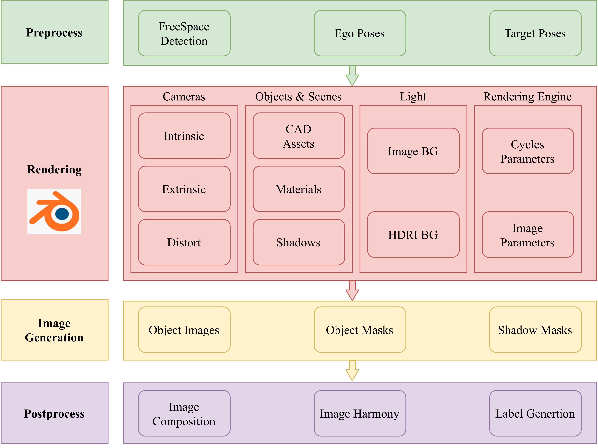

ProcFRDS is a toolkit to synthesize images based on Blender with the mode of Virtuality & Reality which means synthesizing objects and combining them with real images. The toolkit corresponds to that we used in the paper "Vista+, a data-driven synthetic data generation framework based on a single-view novel new synthesis(NVS) method for autonomous driving".

The procedure is as shown below and with our procedure, we can synthesize any wanted objects in target images for different tasks.


### Requirements
    python 3.11
    bpy 4.1
### Necessary Parameters
Camera Parameters(Intrinsic, Extrinsic, Distortion Coefficient(if needed)) <br>
Intrinsic parameters are in the format of 3\*3 matrix and Extrinsic parameters are in the format of 4\*4 matrix, such as: <br>
    ```np.array([[796.8910634503094, 0.0, 857.7774326863696], <br> 
            &nbsp;&nbsp;&nbsp;&nbsp;&nbsp;&nbsp;&nbsp;&nbsp;&nbsp;&nbsp;&nbsp;&nbsp;&nbsp; [0.0, 796.8910634503094, 476.8848988407415], <br>
             &nbsp;&nbsp;&nbsp;&nbsp;&nbsp;&nbsp;&nbsp;&nbsp;&nbsp;&nbsp;&nbsp;&nbsp;&nbsp; [0.0, 0.0, 1.0]]) <br>
    np.array([[ 0.00921541, -0.0068005, -0.99993441, 0.05524611], <br>
             &nbsp;&nbsp;&nbsp;&nbsp;&nbsp;&nbsp;&nbsp;&nbsp;&nbsp;&nbsp;&nbsp;&nbsp;&nbsp; [0.99989479, 0.01126488, 0.00913843, 0.01078824], <br>
            &nbsp;&nbsp;&nbsp;&nbsp;&nbsp;&nbsp;&nbsp;&nbsp;&nbsp;&nbsp;&nbsp;&nbsp;&nbsp; [0.011202, -0.99991342, 0.00690359, 1.56794287], <br>
            &nbsp;&nbsp;&nbsp;&nbsp;&nbsp;&nbsp;&nbsp;&nbsp;&nbsp;&nbsp;&nbsp;&nbsp;&nbsp; [0, 0, 0, 1]]) <br>```

Poses(Ego poses, Target poses) <br>
Each pose includes 6 elements: rotation(pitch, roll, yaw) and location(x, y, z) and all poses are in world coordinates.
### Running Examples
    python scripts/vr_generation.py --car_file object_CAD_model_path --pose_file pose_file_path --ori_img original_image_path --out_path output_rendered_image_path
### Output Demo

